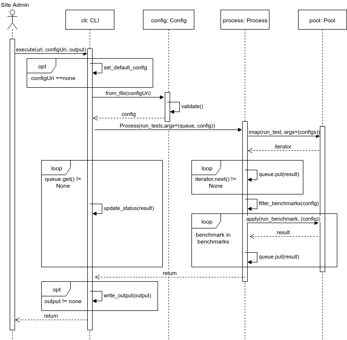

# Design

* [CLI](#cli)
* [Web App](#webapp)

### CLI

The CLI will load the test/benchmark configurations from a JSON file. This may be overridden from the command-line. The configurations will be sorted into tests and benchmarks. The tests will be ran in parallel and finally the benchmarks will run sequentially. The multiprocessing library will spawn a process to run the certification and provide the user with updates. A process pool will be used to run the tests in parallel as well as run the sequencial benchmarks.

### Web App
TODO
